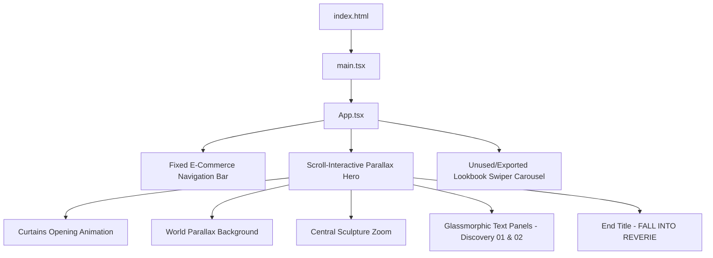

# Website Structure - Roviks Luxury E-Commerce Landing Page

This document provides a detailed breakdown of the file structure, component hierarchy, interactive sections, and styling mechanics of the **Roviks** luxury fashion web application.

---

## 📂 Project Directory Structure

```yaml
Kratos/
├── public/                 # Static assets directory
│   ├── assets/             # Core background images & overlays
│   │   ├── background.jpg  # Hero scene world background
│   │   ├── jesus.png       # Hero scene central statue
│   │   ├── logo.png        # Roviks text logo (transparent PNG)
│   │   └── seclayer.jpg    # Portal zoom frame layer
│   ├── images/             # Lookbook & campaign imagery
│   │   └── x.com/          # High-fashion illustration slides
│   ├── favicon.svg         # Tab icon
│   └── icons.svg           # Sprite vector icons
├── src/                    # Source code directory
│   ├── assets/             # Sub-assets
│   ├── lib/
│   │   └── utils.ts        # CN (Classname merging helper using clsx/tailwind-merge)
│   ├── App.css             # Main styling rules & animations
│   ├── App.tsx             # Main React entrypoint containing layout, states & components
│   ├── index.css           # Global Tailwind directives & fonts
│   └── main.tsx            # React application mount script
├── index.html              # HTML shell
├── package.json            # Node dependencies and scripts
├── tailwind.config.js      # Tailwind CSS layout configurations
├── tsconfig.app.json       # TypeScript compiler settings for frontend
└── vite.config.ts          # Vite build plugin definitions
```

---

## 🎨 UI Architecture & Section Flow

The landing page is engineered as a single-page immersive scrolling experience. The layout consists of the following sections:



### 1. Fixed E-Commerce Navigation Bar
A floating header pinned to the top of the viewport. It transitions from transparent to blurred glassmorphic on scroll.
- **Left Side**:
  - **Collections**: Leverages standard hover animations to reveal a category menu dropdown (New Arrivals, Oversized Tees, Hoodies, Shirts, Bottomwear, Accessories, Limited Edition, Sale).
  - **Editorial**: Direct link.
- **Center**:
  - **Logo**: Centers the transparent brand logo image.
- **Right Side**:
  - **New Arrivals**, **Our Story**, and **Shop** (accentuated gold link).
  - **E-Commerce Icons**: Solid white circular circles (`w-8 h-8 rounded-full`) housing black SVG line glyphs for Search, Account, and Cart.
- **Mobile Menu**: Includes a fully responsive burger toggle that slides down a fullscreen navigation drawer menu.

### 2. Scroll-Interactive Parallax Hero (480vh Height)
An interactive space driven by window scroll progress via requestAnimationFrame (RAF) loops.
* **Curtain Reveal**: Curtains slide outward horizontally (`translateX(-62%)` and `translateX(62%)`) as soon as the page loads.
* **Parallax Scroll Layers**:
  * **World Background**: Zooms from `1.0` to `1.18` on scroll. Includes mouse coordinates parallax.
  * **Central Sculpture (Jesus)**: Moves upward into frame on scroll and zooms from `1.0` to `1.4`.
  * **Portal Frame**: Acts as a framing window that expands (`scale: 1` to `7.5`) and fades out as the user scrolls deep into the scene.
  * **Glassmorphic Information Cards**:
    * **Discovery 01 (Editorial)**: Rises from bottom (`sp = 0.60` to `0.80`).
    * **Discovery 02 (The Collection)**: Rises from bottom (`sp = 0.80` to `1.00`).
* **Descend Scroll Cue**: A subtle arrow and letter-spaced text that prompts the user to scroll.
* **Main Title Page**: Resolves at the bottom of the scroll sequence showing the bold brand slogan **"FALL INTO REVERIE"** alongside a highly readable black description paragraph on the golden sky.

---

## 🛠 React Components Manifest

Within [App.tsx](file:///c:/Users/Manas%20Sharma/OneDrive/Desktop/Kratos/src/App.tsx), the following helper components are declared and structured:

| Component Name | Type | Description |
| :--- | :--- | :--- |
| `App` | Default Export | Governs state (`scrollProgress`, `mobileMenuOpen`, `collectionsOpen`), scroll & mouse listeners, RAF rendering loop, and overall page structure. |
| `Logo` | Helper Component | Encapsulates the relative positioning and constraints for the brand logo SVG/image. |
| `Skiper49` | Exported Section | A section container designed for the Lookbook slides (currently omitted from render but preserved in code). |
| `Carousel_003` | Exported UI | A highly customizable Swiper carousel component with coverflow effect, gold pagination bullets, and static glassmorphic navigation arrows. |

---

## 💡 Animation Mechanics & Interpolations

The parallax scroll is mathematically driven by the `scrollProgress` value (normalized `0.0` to `1.0` relative to the page height). 

```typescript
// Core interpolation functions defined in App.tsx:
const easeInOut = (t: number) => t < 0.5 ? 2 * t * t : -1 + (4 - 2 * t) * t;
const lerp = (a: number, b: number, t: number) => a + (b - a) * t;
const clamp = (val: number, min: number, max: number) => Math.min(Math.max(val, min), max);
```

Using these utilities, the requestAnimationFrame loop calculates positions dynamically:
- **Mouse Parallax**: Smoothly interpolated using a lerp factor of `0.07` to track cursor movement on desktop.
- **Scroll Zoom**: Zoom multipliers are applied to CSS `transform: scale()` styles, avoiding layout thrashing.
